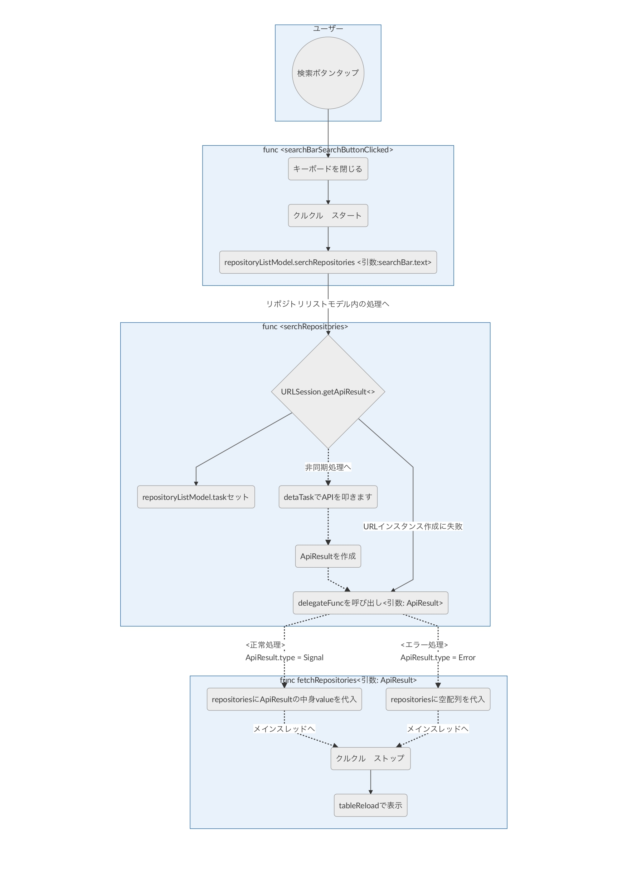

# 初級　Branch: level_A

## #2 ソースコードの可読性の向上

- 命名規約（参考：[Swift API Design Guidelines](https://swift.org/documentation/api-design-guidelines/)）
- Avoid abbreviations. に則って略語を訂正
- Follow case conventions. に則って大文字小文字の規則を統一
    - その他役割と名前が結びつかない部分を修正
- ネスト
    - if let と guard let の使い分けによりネストを減らしました。
- インデント
    - control + i
- コメントの適切性
    - コメントの指しているメソッドが違ったので修正
    - その他（"遷移時"ではなく"遷移前"など）微調整
- スペースや改行
    - あったり無かったりを統一
- その他
    - 順番を変えたり

## #3 ソースコードの安全性の向上
- 強制アンラップ
- 強制ダウンキャスト
- 不必要なIUO
- 想定外の nil の握り潰し
総じてnilチェックやエラーチェックでエスケープを作りました。
エラー処理方法に関しては[Error Handling Rationale and Proposal](https://github.com/apple/swift/blob/master/docs/ErrorHandlingRationale.rst)の適用を後の課題とします。

## #4 バグを修正
- レイアウトエラー
    - storyboardのauto layout不足の解消
- メモリリーク
    - 遷移前後のビューが互いを参照してしまっているのでモデルを介します。
    - デリゲートは弱参照でメモリリーク解消
- パースエラー
    - スペルミスを発見
    - そもそもGitHubのwatchersの概念が変更するようで、詳細画面遷移時にもう一度apiを叩く仕様に変更＜[参考記事](https://github.com/milo/github-api/issues/19)＞

  

## #5 Fat VC の回避
- 各ビューコントローラーのURLsessionTask周りの責務を別途モデルを作って移譲
  

# 中級 Branch: level_B

## #6 プログラム構造をリファクタリング
- DRY 原則
    - URLsessionを使ったApi処理を繰り返しているので、URLSessionにextensionで、getApiResultという関数を作って一つにまとめました。
- CQS 原則
- 単一責任原則
    - モデルはビジネスロジックのみ
    - VCは受け渡しと表示処理のみ
- インターフェイス分離の原則
- 驚き最小の原則
    - 詳細画面遷移時にwatchのみ遅れて表示される可能性を無くしました。
    - 検索ボタンを押した時の反応を修正
        - ラグがあるのでフリーズしてるように見える→クルクルインジケーターを付けました。
        - キーボードが出っぱなしなので、閉じるように修正
## #7 アーキテクチャを適用
- cocoa MVCの適用にチャレンジ
    - #5 #6によってvcの責務を分けました。
    - Model　ビジネスロジック（getApiResultなど）
    - View　storyboardなど
    - Controller　ViewControllerの責務
        - ユーザーの入力を受けてモデルに入力内容を渡す。
        - モデルとViewを保持しモデルの変更を受け付けてViewをロード。

  
## #10 テストを追加
  

# ボーナス
 

## #8 UI をブラッシュアップ
 - 検索画面に画像や星などを表示して見栄えをよくしました。
  

## #9 新機能を追加

## その他
 - Nukeを使って画像を表示
 - UIColorのエクステンションで言語毎の色を取得できる関数を追加
     - ハードコーディング未修正
- TableViewにSearchBarが内包されているのが違和感（一緒にスクロールしてしまう）なので外側にViewControllを作って兄弟にしました。

### 階層は下記となります。
SearchRepositoryViewController 
 - RepositorySearchBar  
 - RepositoryListTableViewController  
     - RepositoryListTableViewCell

# コードチェック後の独学用のブランチ: after_the_codecheck_period

### 検索ボタンタップ時の動きを整理してみます。

# レビューをしてもらってからの改善について

### 改善点
- ApiResultはジェネリックを利用すると、よりシンプルなI/F設計ができるように感じました。
    - ジェネリクスについて勉強しました、動的に型を指定できるようです。ただ今回どのように適用させるとよりよくなるかがわからない、、、
    - 現状のvalueを参照する時にデータを加工するのではなく、イニシャライズ時に加工したデータをバリューに放り込んで、その時にジェネリクスで型を指定するか、、、
- UITableViewのレイアウトが適切に設定されていないため、端末サイズによっては見切れたりしています。
    - これは提出後でしたが自分で気づき改善できました！
- languageColorViewは一度非表示にすると元に戻す処理がないため、スクロールするたびに色のついた丸が減っていきます...
    - if languageLabel.text == "" ではなく if language　※中身はrepositoryData["language"]  ==""　のように直接参照すると改善しました。。。表示する処理が別のスレッドで参照にラグがあるのかな？？
- テストが実装されていないのが残念でした。
    - テストについてはまだよくわかりません、、、XcTextCaseのクラス内で実際に使っているモデルなどをインスタンス化してサンプルデータを入れて動かしてみるといった考え方だと認識しておりますが、サンプルデータを入れるためにはまずモデルクラスのビジネスロジックの部分をDIによる構成に変更してテストが書ける状態に変更すべきとまではわかるのですが、DIの仕方がいまいち掴めません。
- 通信エラーのときにユーザーにその旨を伝える仕組みがあると、より良いと感じました。
    - エラー毎にエラ〜メッセージを決めてダイアログ表示させるようにします。

------------------------------------
※上記に対しての追記です。
Next
- JsonのparseはDecodableなど使うとよいです
- typo serch、Tabel Xcodeのスペルチェック機能が便利です。
    - 眼から鱗がいっぱい出てきました。（参考：[Xcode11のSpell Checkにつまずいた](https://qiita.com/am10/items/2cf5576d7b36b4097cac)）
- searchBarはNavigationBarにいれるとスクロールなど簡単に対応できます
- ApiResultTypeにJson,Imageと並んでErrorがあり、呼び出し時にはErrorを使う事はなさそうなので、ApiResultTypeからは消してRequestTypeとして分けるかdelegateFuncを(Result<ApiResult>, Error) -> Voidのような形にするとよいです
------------------------------------
